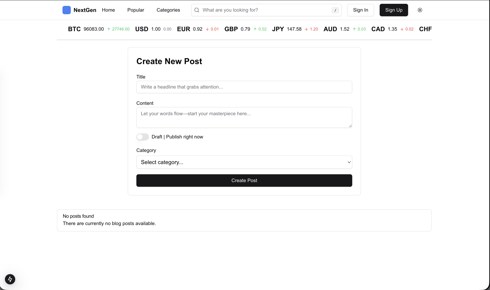
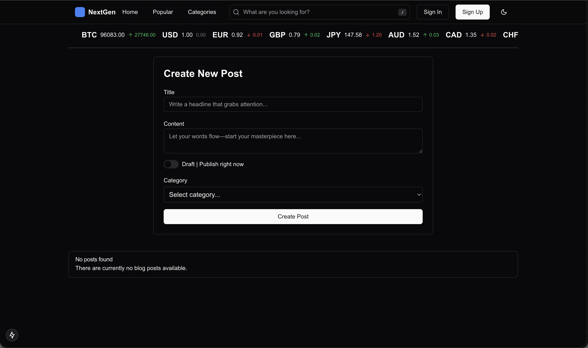
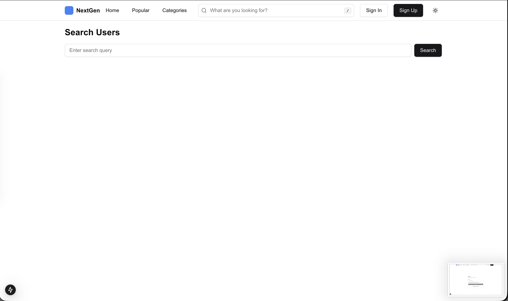
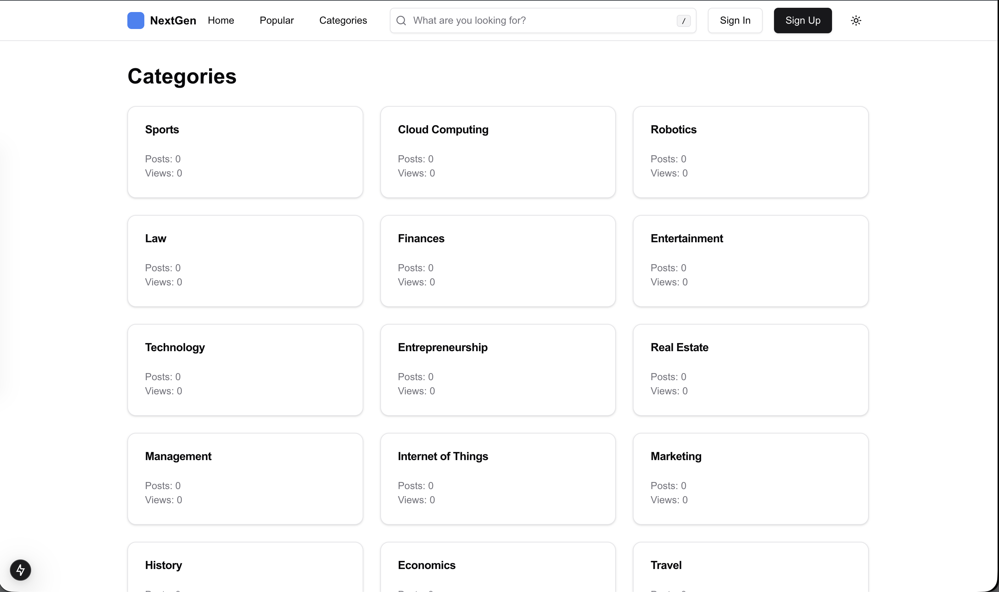
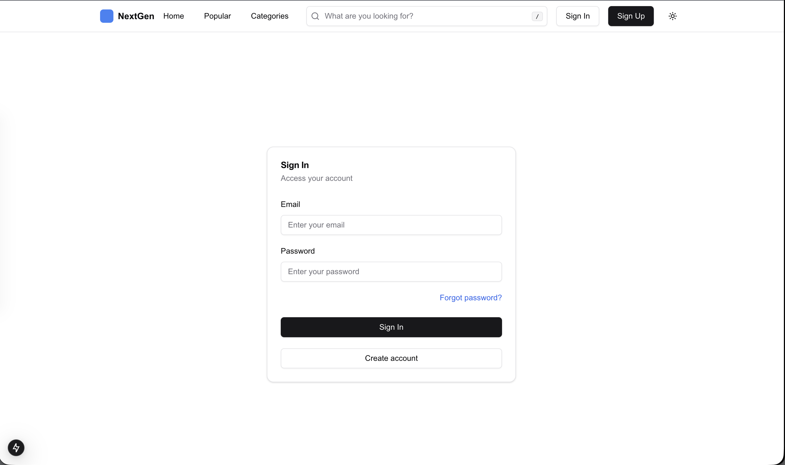
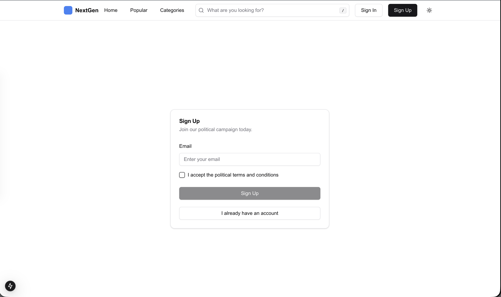

# 📝 NextGen Blogpost (DBMS University Project)

**Full-Stack Developer**
Университетский проект по дисциплине «Системы управления базами данных» (СУБД), реализованный во время обучения на 2-м курсе. Проект представляет собой современную блог-платформу, созданную с целью глубокого изучения реляционных баз данных и написания чистого, оптимизированного SQL-кода без использования ORM-прослоек (Prisma, TypeORM и др.).

🔗 **Link:** `Local Deployment` | 💻 **GitHub:** [Code in Github](https://github.com/defiveninth/nextgen-blog-app)

---

### 🛠 Технологии
* **Frontend:** React, Next.js (App/Pages Router), Tailwind CSS
* **Backend:** Next.js Server Actions / API Routes, Node-Postgres (`pg` driver)
* **Database:** PostgreSQL (Чистый SQL)
* **Цель проекта:** Освоение синтаксиса сложных SQL-запросов, построение реляционных связей, агрегация данных и проектирование производительной структуры БД.

---

### 🎯 Реализованный функционал
* **Связи без ORM:** Взаимодействие с PostgreSQL реализовано через прямой запуск сырых SQL-запросов (`SELECT`, `INSERT`, `UPDATE`, `DELETE`, `JOIN`) с использованием параметризации для защиты от SQL-инъекций.
* **Категории и Связи (Many-to-Many):** Реализована реляционная связь «многие ко многим» между публикациями и категориями через промежуточную таблицу (просмотр и фильтрация в `categories.png`).
* **Полнотекстовый поиск (Search):** Организован поиск по статьям с использованием встроенных возможностей текстового поиска базы данных (индексация и операторы фильтрации).
* **Авторизация и Сессии:** Ручная проверка учетных данных пользователей, хэширование паролей и регистрация новых аккаунтов (`sign-in.png` / `sign-up.png`).
* **Кастомизация интерфейса:** Реализована полноценная поддержка темной темы на уровне фронтенда (`home-dark-mode.png`).

---

### 💻 Интерфейс

#### 1. Главная страница (Светлая и Темная темы)

  

  

#### 2. Поиск и Категории блога

  

  

#### 3. Аутентификация (Вход и Регистрация)

  

  

