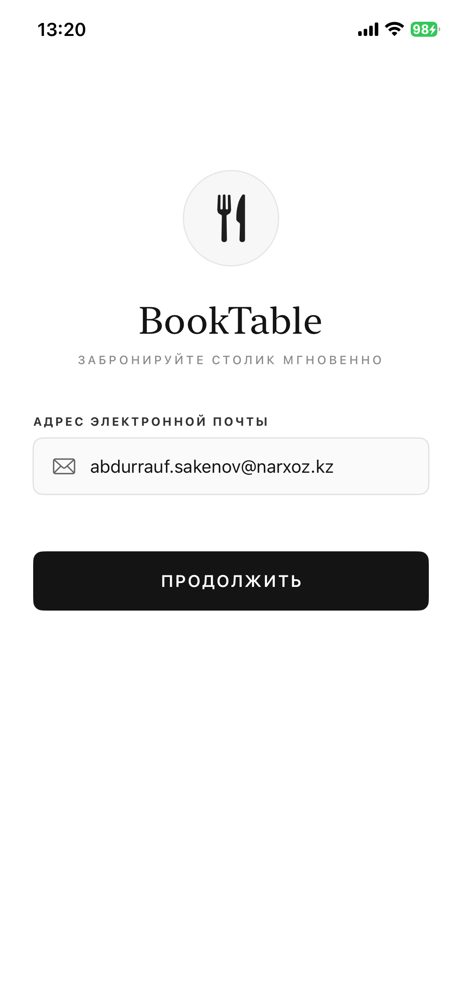
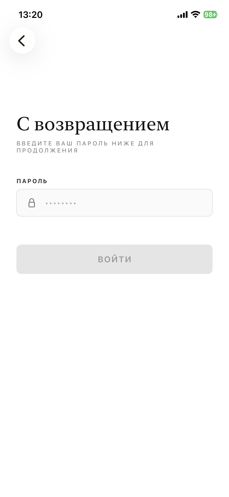
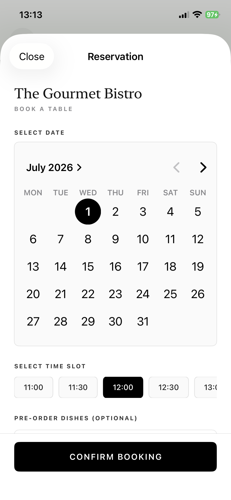
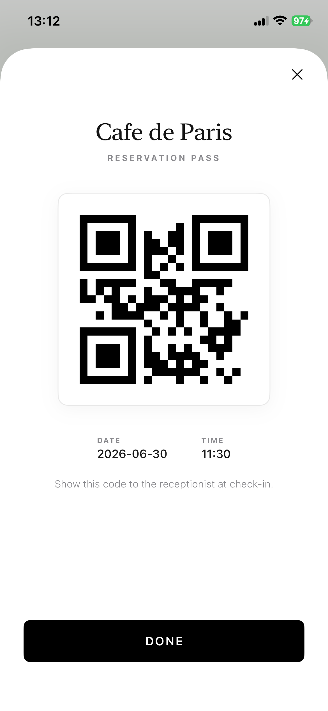
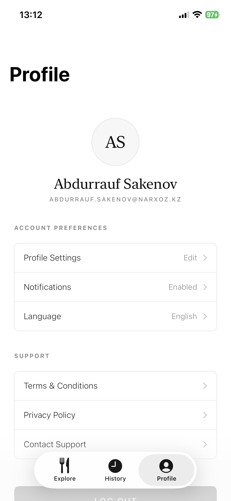
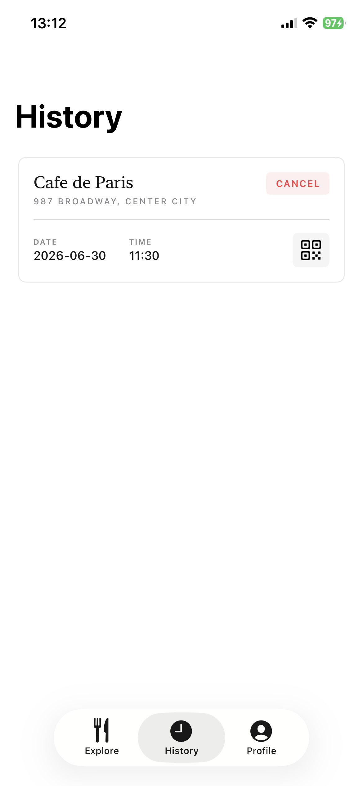
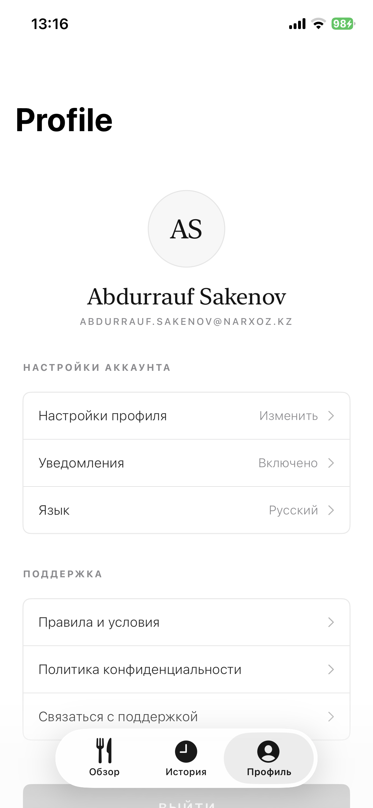
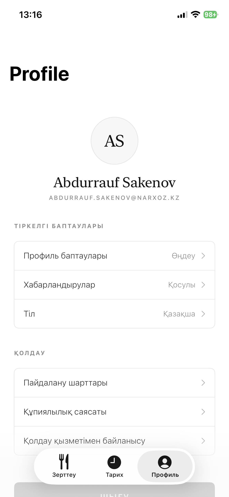

# 🍽 Book Table (RRS Mobile)

**Learning Swift Project**
Это учебный проект мобильного приложения для бронирования столиков в ресторанах. Приложение создано исключительно в образовательных целях для практики разработки на языке Swift и освоения SwiftUI.

🔗 **GitHub:** [github.com/defiveninth/rrs-mobile](https://github.com/defiveninth/rrs-mobile)

---

### 🛠 Технологии
* **Язык:** Swift
* **UI Framework:** SwiftUI
* **Цель:** Изучение архитектуры iOS-приложений, навигации, обработки форм и управления состоянием.

---

### 🎯 Основной функционал
* **Аутентификация:** Процесс входа в систему и подтверждение аккаунта.
* **Поиск и просмотр:** Главный экран с ресторанами и детальный просмотр информации о заведении.
* **Бронирование:** Пошаговый процесс выбора столика и подтверждения бронирования.
* **Личный кабинет:** Профиль пользователя с поддержкой локализации (RU/KZ) и история заказов.

---

### 💻 Интерфейс (App Preview)

#### Авторизация

  
  

#### Главный экран и Рестораны

  
  

#### Процесс бронирования

  
  

#### Профиль и История

  
  

#### Локализация (i18n)

  
  

---