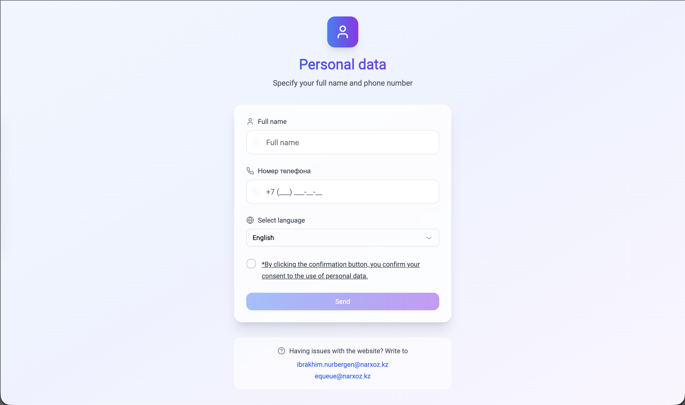
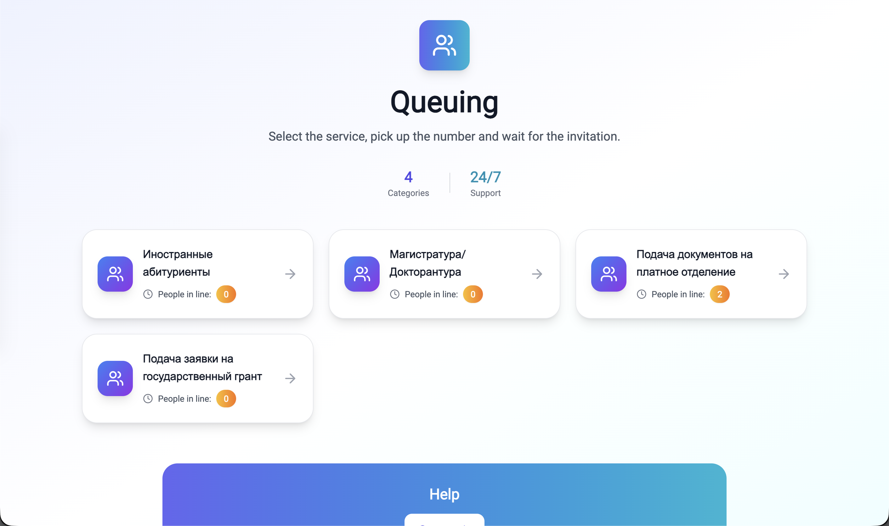
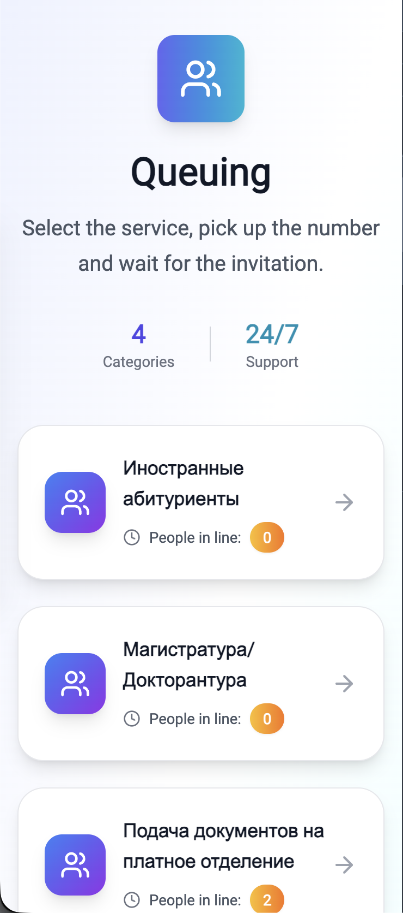

# 👥 Электронная очередь Narxoz University

**Frontend-разработчик** | Веб-приложение для цифровизации и управления потоком абитуриентов в режиме реального времени.

---

### 🛠 Технологии
* **Frontend:** React, Next.js, Tailwind CSS
* **Real-time:** WebSockets (Socket.io) — мгновенное обновление счетчиков без перезагрузки страниц
* **Архитектура:** REST API, i18n (KZ, RU, EN)

---

### 💻 Интерфейс

#### 1. Авторизация и ввод данных

  

#### 2. Выбор категорий (Десктоп)

  

#### 3. Адаптивная мобильная версия

  

---

### 🎯 Реализованный функционал
* Разработка адаптивного UI/UX для десктопных и мобильных устройств.
* Интеграция WebSockets для синхронизации живой очереди `People in line` между клиентом и сервером.
* Оптимизация производительности фронтенда для стабильной работы при пиковых нагрузках приемной комиссии.