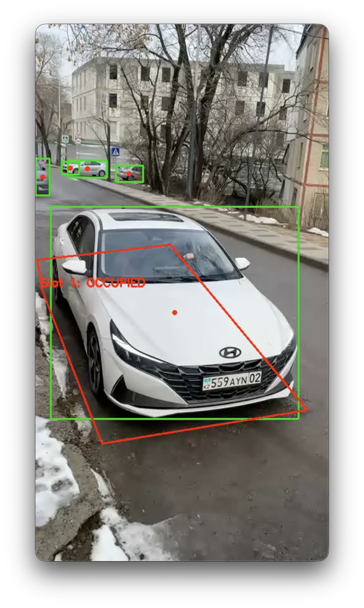
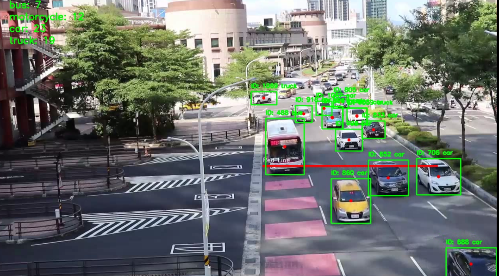

# 🚗 Parking Count (AI Computer Vision Service)

**Python / Computer Vision Developer**
Локальная офлайн-система компьютерного зрения для автоматического подсчета количества автомобилей в помещении или на парковке с помощью веб-камеры и отправки данных на сервер в реальном времени.

🔗 **Link:** `Not in Production` | 💻 **GitHub:** [Code in Github](https://github.com/dilfuza00/parking-app/tree/main/parking-client)

---

### 🛠 Технологии
* **Core & AI:** Python, YOLOv8 (Ultralytics) — предобученная модель для точного распознавания объектов.
* **Computer Vision:** OpenCV (cv2) — захват видеопотока, рендеринг Bounding Boxes и кастомного UI поверх кадра.
* **Интеграция:** HTTP Requests, python-dotenv (управление конфигурацией через `.env`).

---

### 🎯 Реализованный функционал
* **Офлайн-детекция транспорта:** Использование легковесной и быстрой модели `yolov8n.pt` с фильтрацией классов для обнаружения только целевых объектов (легковые машины, мотоциклы, автобусы, грузовики) с уверенностью $conf \ge 0.5$.
* **Умный шедулинг отправки:** Алгоритм отправляет текущее количество машин на внешний API-сервер (`/api/parking/spots/:id/update-count`) с задержкой в 10 секунд после старта, а затем стабильно синхронизирует данные каждые 60 секунд.
* **Информативный HUD (Heads-Up Display):** Прямо на видеопоток выводятся счетчики в реальном времени: количество машин в кадре, последнее успешно отправленное число, таймер обратного отсчета до следующего запроса и текущий статус (`WAITING` / `SENDING...`).
* **Оптимизация ресурсов:** Ограничение частоты обработки кадров через `time.sleep` для снижения нагрузки на CPU/GPU без потери точности трекинга.

---

### 💻 Интерфейс

#### 1. Мониторинг парковочной зоны на месте (On-Place Checker)

  

#### 2. Пересечение линий и подсчет трафика (On-The-Line Counter)

  

