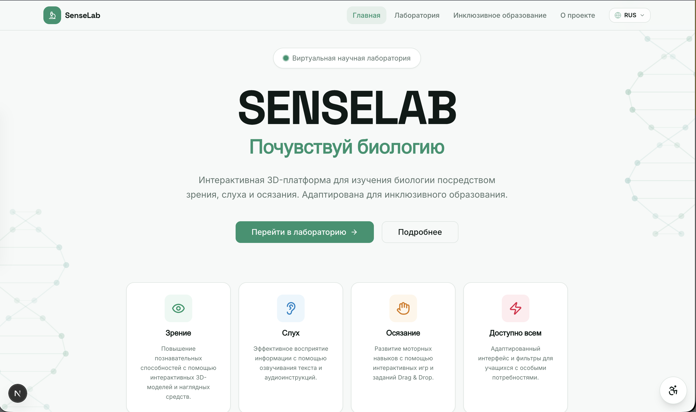
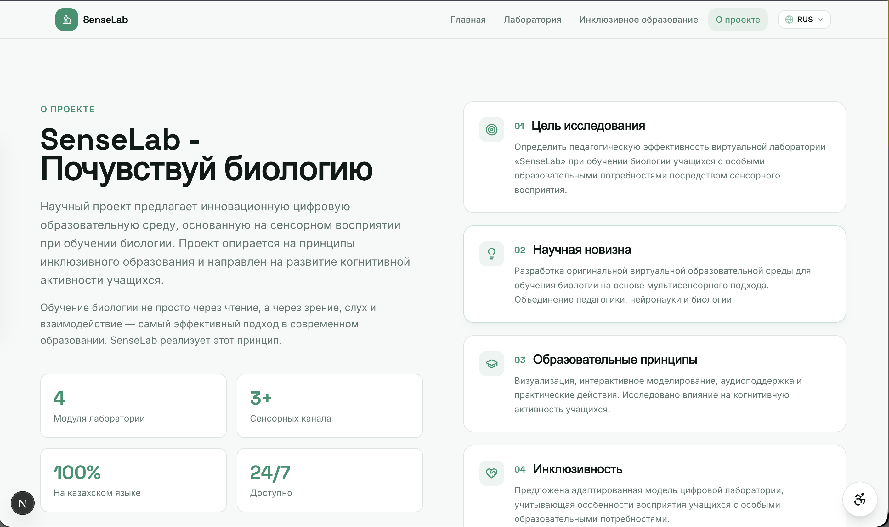
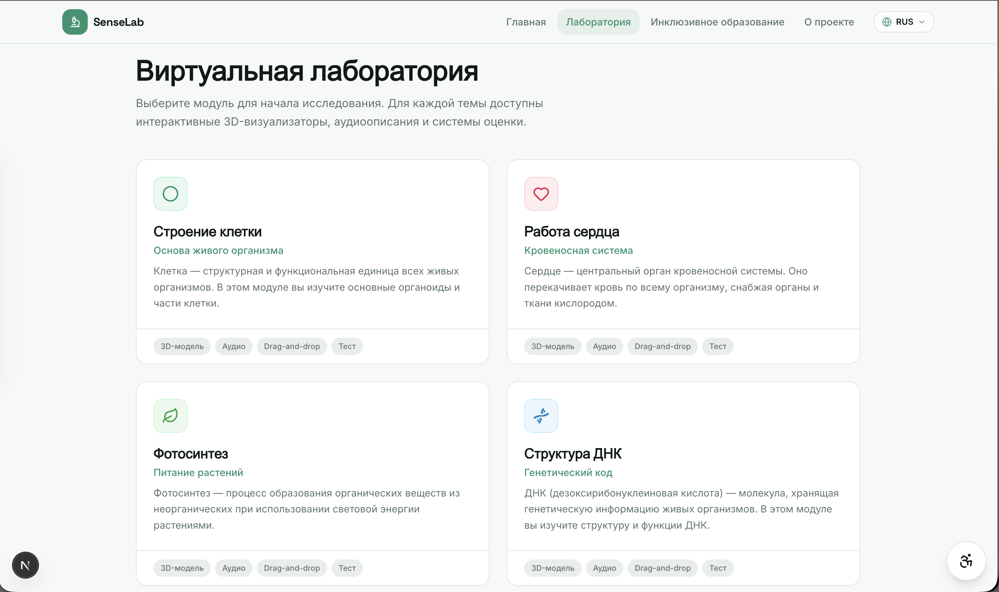
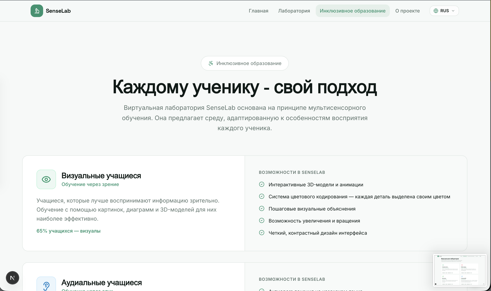
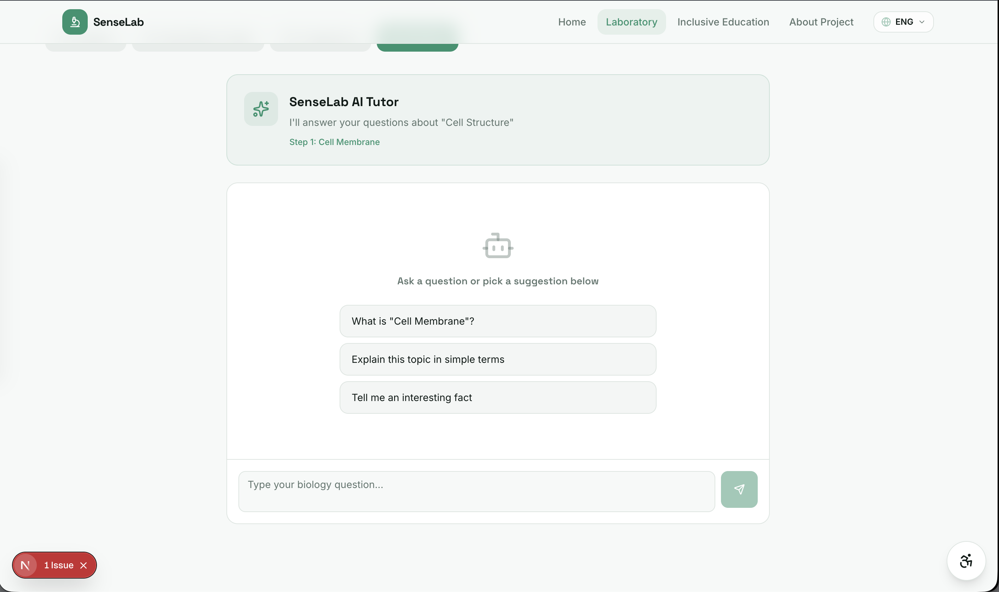
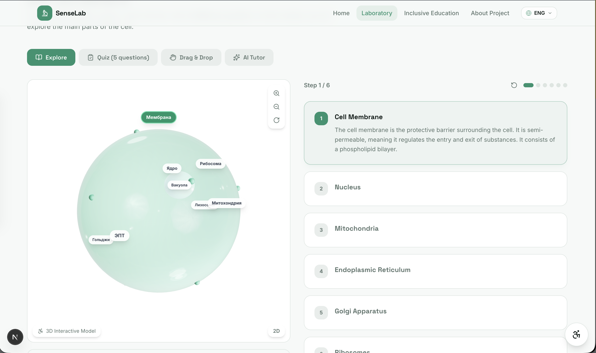
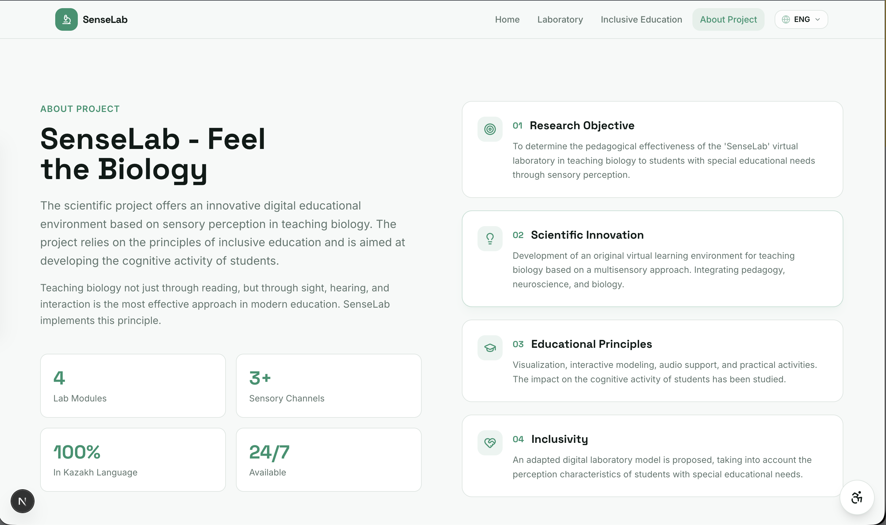

# 🔬 Senselab — AI Research & Lab Management Platform

**Full-Stack Developer (Freelance Project)**
Инновационная веб-платформа для управления лабораторными исследованиями, визуализации научных процессов и интеграции искусственного интеллекта для анализа данных. Проект разработан на заказ в качестве коммерческого фриланс-кейса.

🔗 **Link:** `Not in production` | 💻 **GitHub:** [Code in Github](https://github.com/defiveninth/online-course-pl)

---

### 🛠 Технологии
* **Frontend:** React, Next.js (App Router), Tailwind CSS
* **AI Интеграция:** Gemini API (интеллектуальный исследовательский чат-ассистент)
* **3D Визуализация:** библиотека для рендеринга интерактивных 3D-моделей (Three.js / React Three Fiber)
* **Архитектура:** REST API, структурированная обработка научных данных

---

### 🎯 Реализованный функционал
* **Интерактивная лаборатория (Lab & Process):** Управление рабочими процессами лаборатории, трекинг текущих этапов исследований (Process) и структурирование научных экспериментов.
* **Исследовательский AI-Чат (AI Chat):** Интеграция Gemini API для создания специализированного контекстного ассистента. Помогает исследователям анализировать данные, генерировать гипотезы и интерпретировать результаты тестов.
* **Модуль 3D-визуализации (3D Model):** Интеграция интерактивного компонента для просмотра трехмерных моделей молекулярных структур или лабораторного оборудования.
* **Интернационализация (i18n):** Полноценная локализация интерфейса (включая разделы About и документацию) для поддержки англоязычных пользователей (About in English).

---

### 💻 Интерфейс

#### 1. Главная страница (Home) & Описание платформы

  

  

#### 2. Исследовательский центр и Рабочие процессы

  

  

#### 3. Интеграция ИИ (AI Chat) и 3D-моделирование

  

  

#### 4. Международная локализация

  

