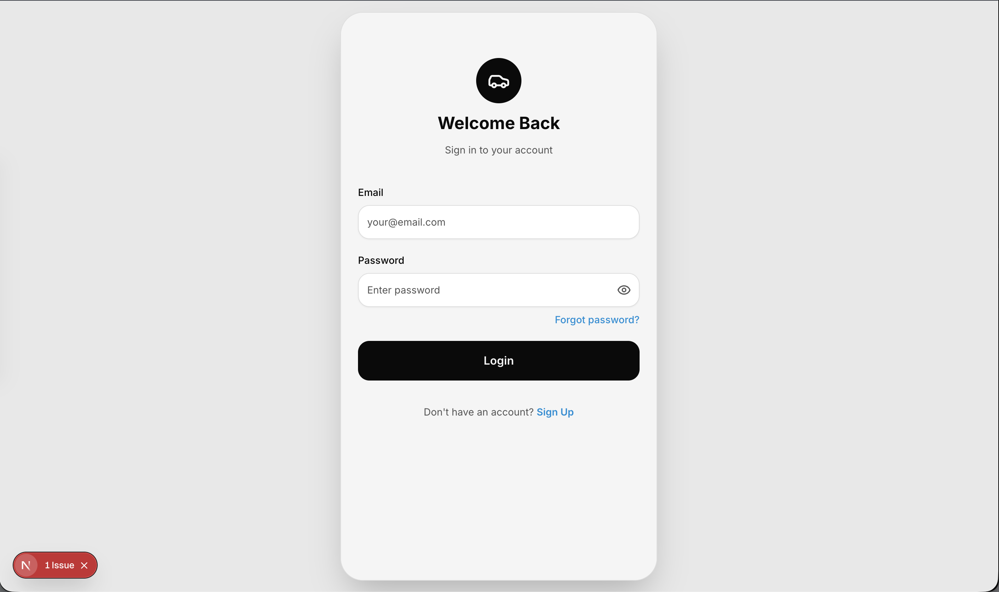
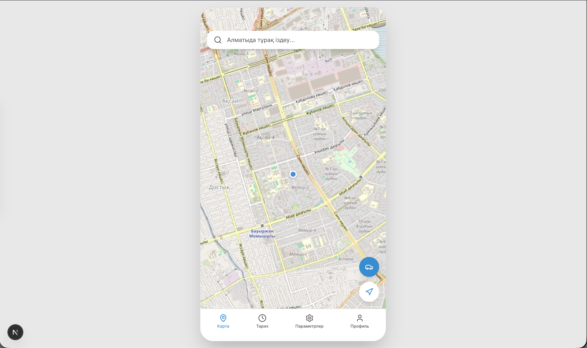
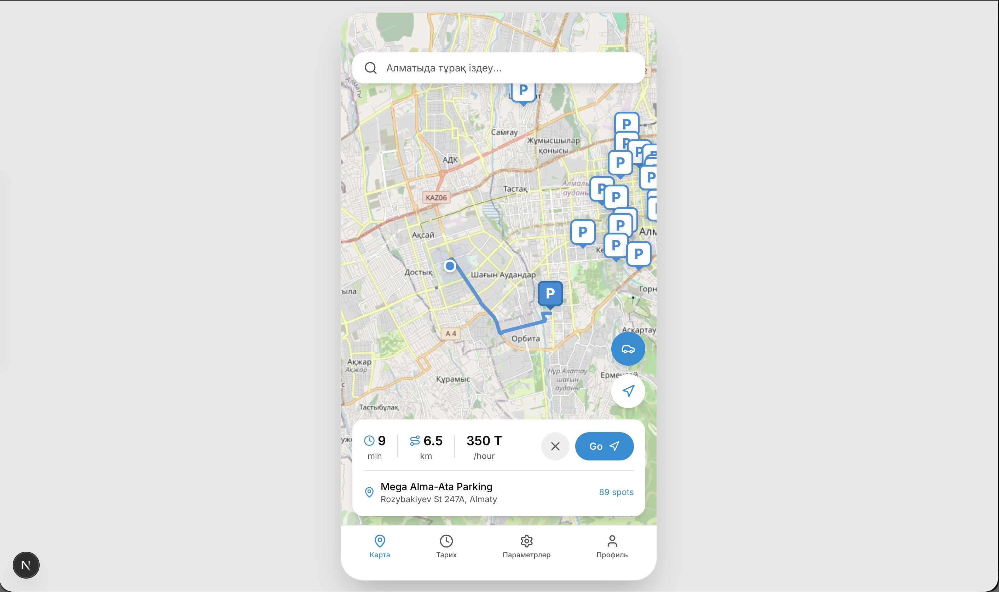
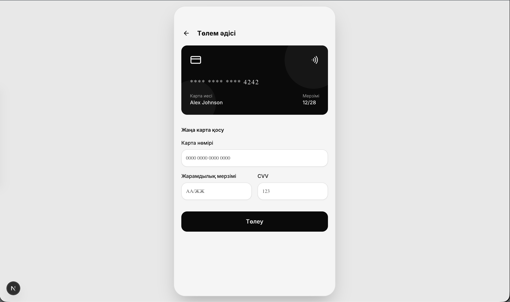
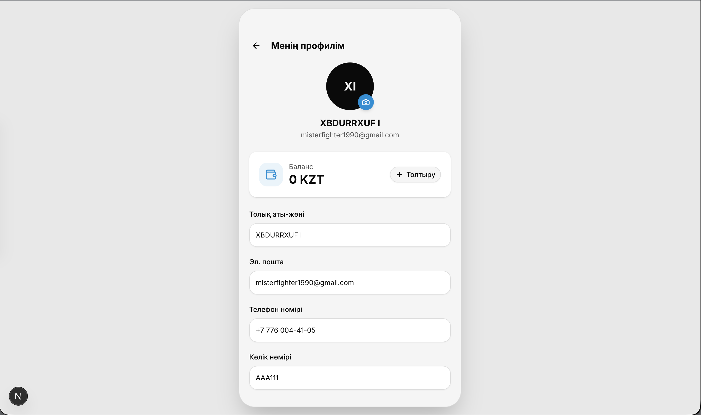
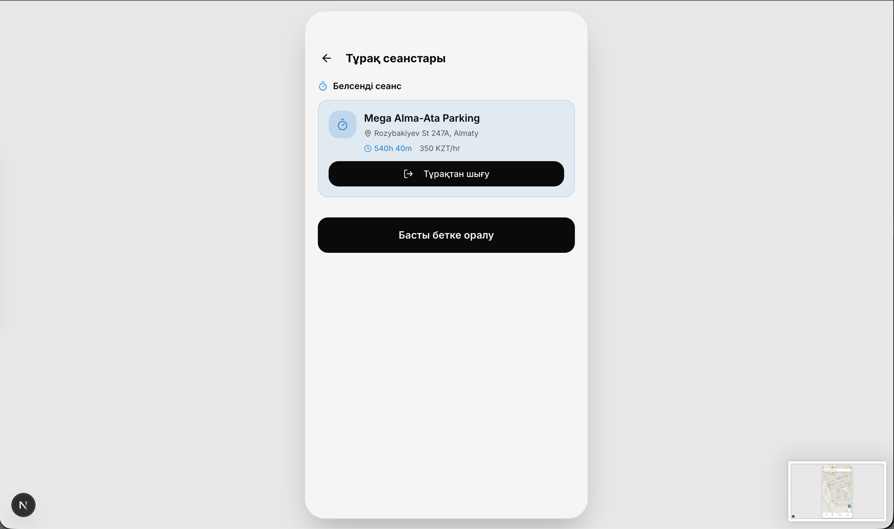
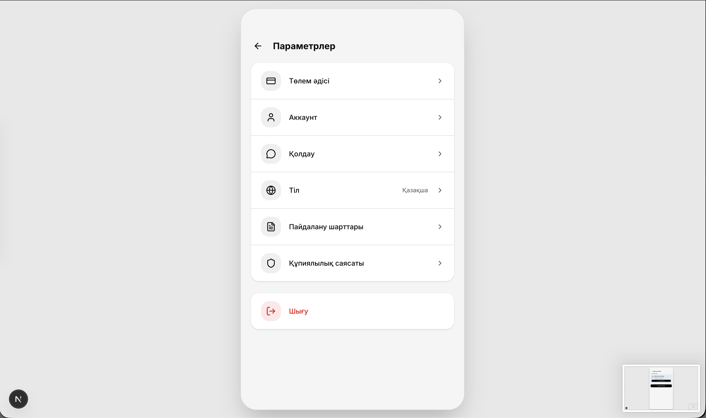
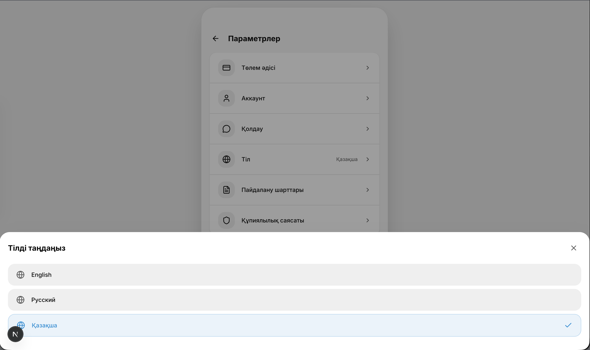

# 🚗 Smart Parking

**Full-Stack Developer**
Веб-приложение для поиска свободных парковочных мест в реальном времени, управления бронированием, бесконтактной оплаты и отслеживания истории сессий.

🔗 **GitHub:** [github.com/dilfuza00/parking-app](https://github.com/dilfuza00/parking-app)

---

### 🛠 Технологии
* **Frontend:** React, Next.js, Tailwind CSS
* **Backend:** Express.js, Node.js
* **Database:** SQLite
* **Архитектура:** REST API

---

### 🎯 Реализованный функционал
* **Поиск парковки (Near Parking):** Интерактивный поиск ближайших доступных парковочных зон с отображением статуса свободных мест.
* **Бронирование и оплата:** Управление методами оплаты (Payment Method), привязка карт и проведение транзакций за парковочное место.
* **Личный кабинет & Сессии:** Профиль пользователя (Profile), детальная история прошлых парковочных сессий (History) и кастомизация системных настроек.
* **Локализация:** Поддержка динамической смены языка интерфейса (Change Language).

---

### 💻 Интерфейс

#### 1. Авторизация и Главный экран

  

  

#### 2. Поиск парковки и Способы оплаты

  

  

#### 3. Профиль, История и Настройки

  

  

  

#### 4. Интернационализация (i18n)

  

