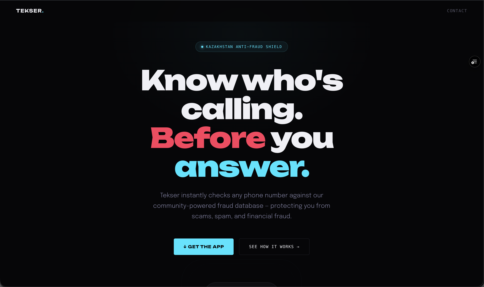
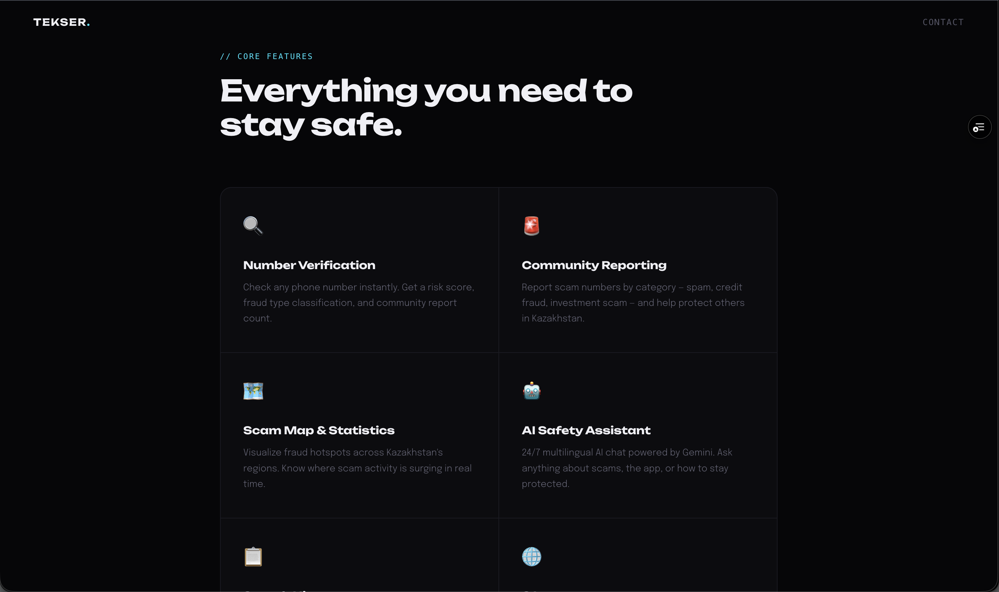
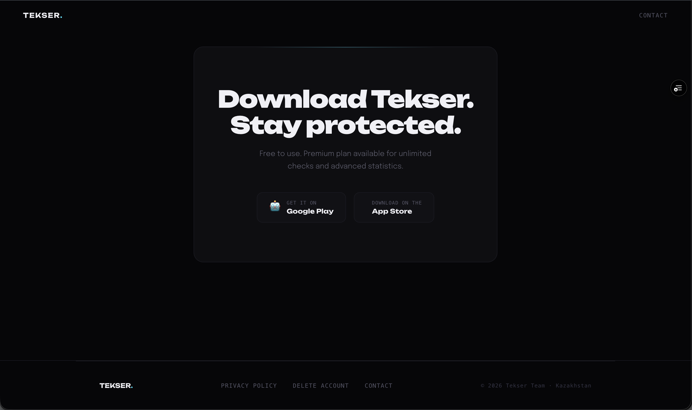
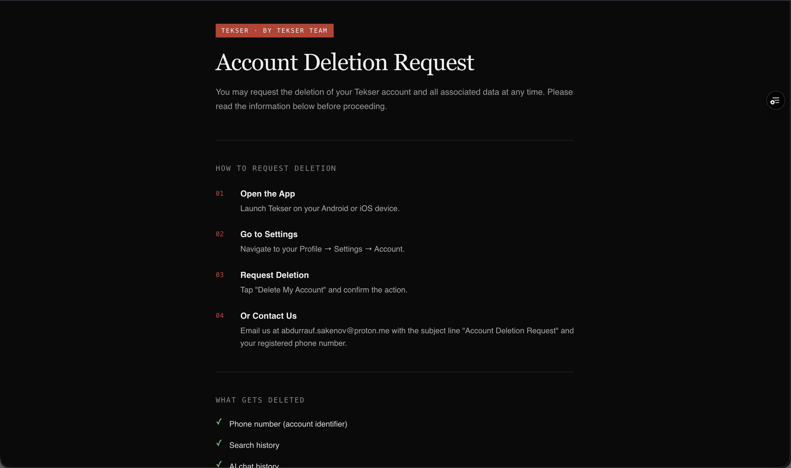
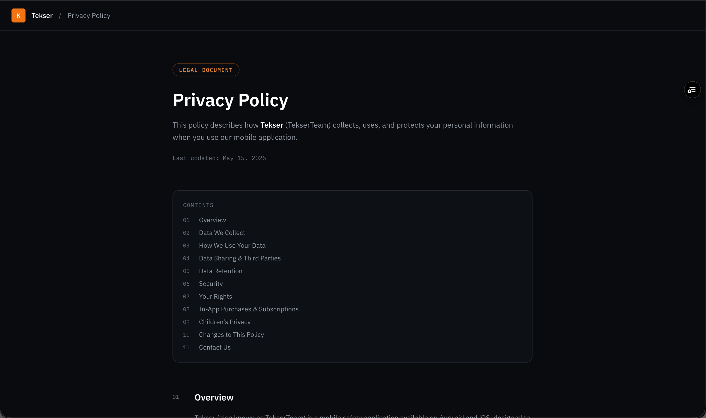

# 🌐 Tekser Landing & Data Deletion Portal

**Frontend-разработчик** | `12.2025 - 05.2026`
Официальный веб-сайт (landing page) проекта Tekser, включающий обязательный портал для удаления пользовательских данных согласно правилам публикации приложений.

🔗 **Link:** [teqserteam.vercel.app](https://teqserteam.vercel.app/) | 💻 **GitHub:** `Private Repository`

---

### 🛠 Технологии & Требования
* **Frontend:** React, Next.js, Tailwind CSS
* **Compliance:** Разработано в строгом соответствии с требованиями **Google Play Store Data Safety Policy** (обеспечение прозрачности сбора данных и предоставление пользователям прямой возможности удаления аккаунта через веб-интерфейс).

---

### 🎯 Реализованный функционал
* Разработка адаптивного промо-сайта (Landing Page) для демонстрации ключевых возможностей антифрод-системы.
* Реализация юридических разделов веб-версии, включая Политику конфиденциальности (Privacy Policy).
* Интеграция функционала **Data Deletion URL**: создание защищенной формы для отправки запросов на перманентное удаление аккаунта и связанных с ним данных из базы без необходимости открывать мобильное приложение.

---

### 💻 Интерфейс

#### 1. Главная страница (Landing)

  

  

  

#### 2. Портал удаления данных (Google Play Compliance)

  

#### 3. Политика конфиденциальности

  

