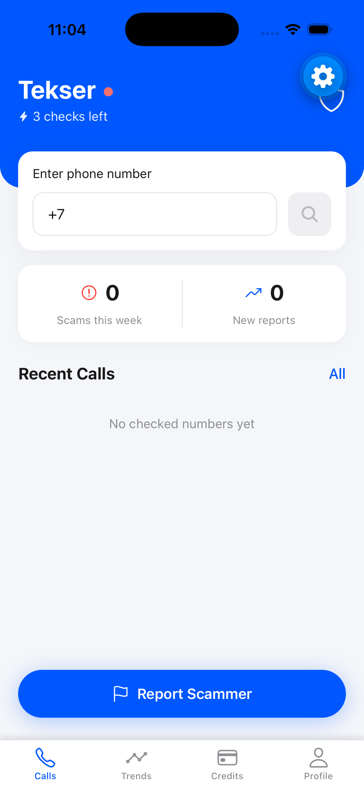
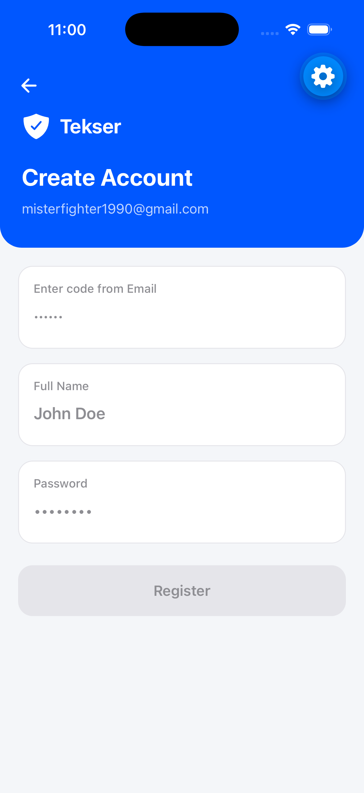
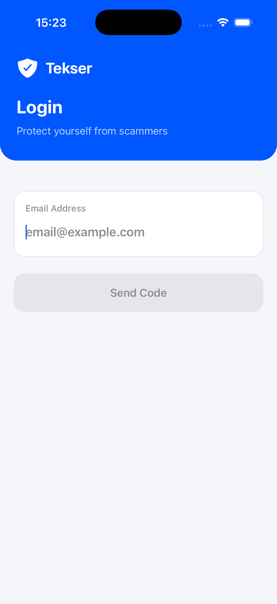
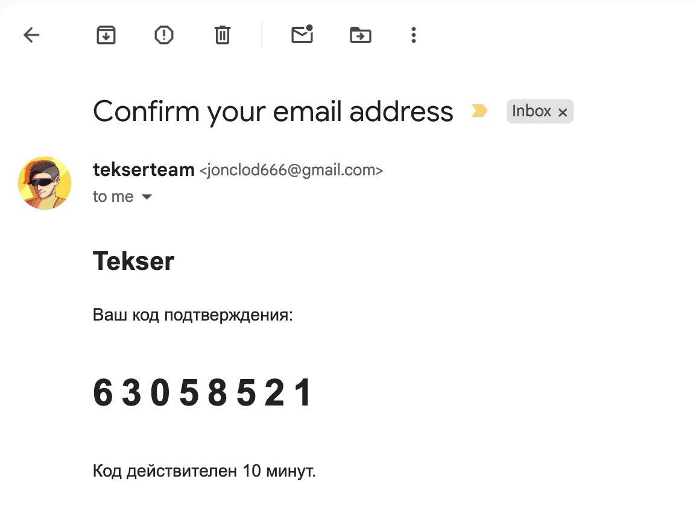
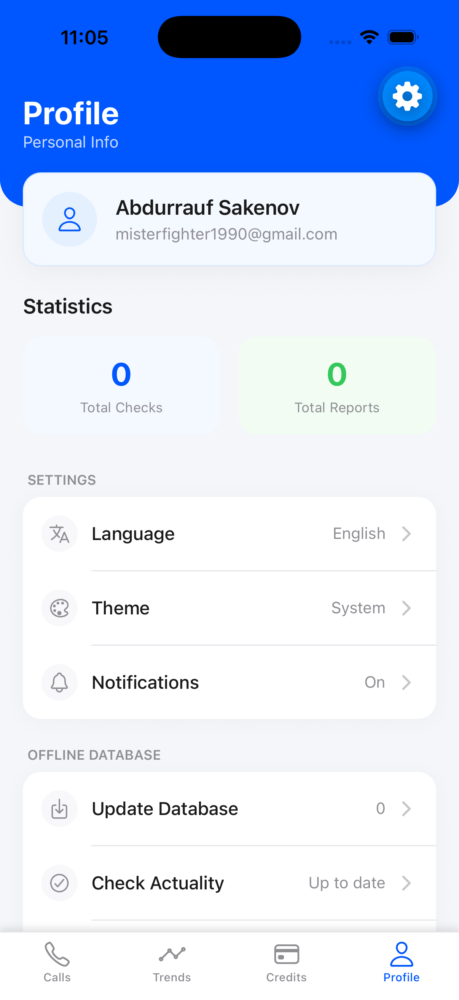
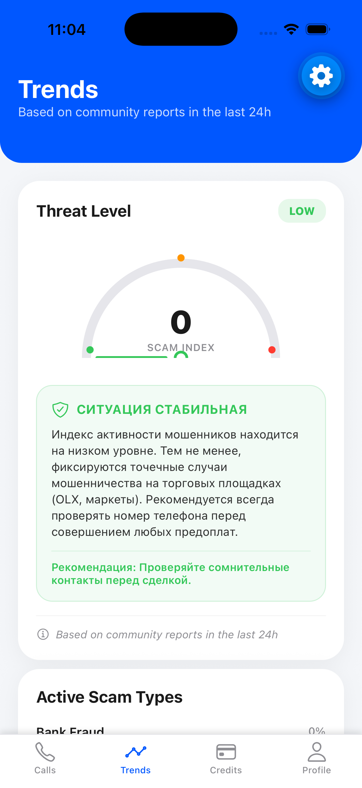
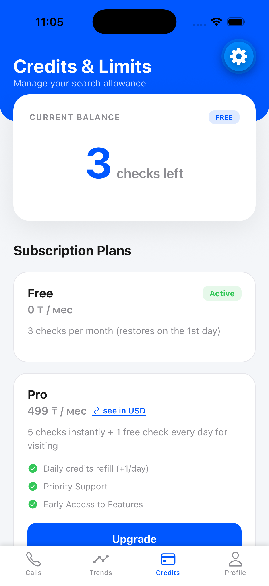
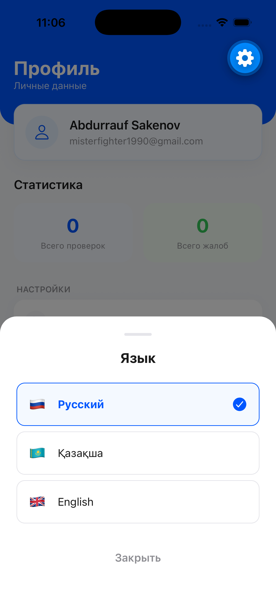
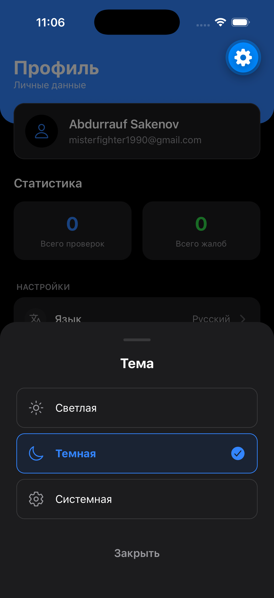

# 🔒 Tekser — Cybersecurity Anti-Fraud Application

**Мобильный разработчик** | `12.2025 - 05.2026`
Мобильное приложение для защиты от мошенничества и обеспечения кибербезопасности пользователей.

🔗 **Link:** `Not in Production` | 💻 **GitHub:** `Private Repository`

---

### 🛠 Технологии
* **Frontend/Mobile:** React Native (Expo)
* **Backend:** Python (FastAPI)
* **Интеграции:** Kaspi Payment API (веб-версия)

---

### 🎯 Реализованный функционал
* Полная разработка мобильного приложения с нуля и его публикация в Google Play Store.
* Проектирование и реализация Backend API на FastAPI, включая миграцию системы авторизации с телефонных номеров на Email-верификацию.
* Интеграция платежного шлюза Kaspi для обработки транзакций.
* Разработка модуля трекинга пользовательской активности в изолированную таблицу базы данных с последующим ИИ-анализом действий пользователей.

---

### 💻 Интерфейс

#### 1. Главный экран (Home)

  

#### 2. Создание аккаунта и авторизация

  

  

#### 3. Email верификация (OTP)

  

#### 4. Профиль пользователя и Аналитика трендов

  

  

#### 5. Подписки и Титры (Credits)

  

#### 6. Мультиязычность (i18n)

  

#### 7. Темная тема (Dark Mode)

  

