# 📅 Wagwan — Smart Social Calendar & Community Events

**Full-Stack Developer**
Умный календарь и социальное мобильное приложение, разработанное для отслеживания планов друзей, обнаружения локальных событий и координации внутри сообществ в режиме реального времени.

🔗 **Link:** `Not in Production` | 💻 **GitHub:** `Private Repository`

---

### 🛠 Технологии
* **Frontend/Mobile:** React Native (Expo)
* **Backend:** NestJS, Prisma ORM
* **Database:** PostgreSQL
* **Архитектура & Протоколы:** REST API, WebSockets (для синхронизации активности)
* **Инструменты:** i18n (мультиязычность), Custom Theme Engine (светлая/темная темы)

---

### 🎯 Реализованный функционал
* **Полный цикл разработки:** Проектирование и реализация клиентской мобильной части, архитектуры бэкенда, схемы данных и серверной логики.
* **Социальный календарь (Home & Upcoming):** Отображение личного расписания пользователя, а также агрегация событий и планов друзей в едином фиде.
* **Обнаружение и Сообщества (Discover & Communities):** Поиск локальных ивентов, создание групп по интересам и просмотр текущей активности сообществ.
* **Связи и Сеть (Connections):** Управление списком друзей, подписками на комьюнити и отслеживание того, «кто чем занимается» в реальном времени.
* **Безопасность и кастомизация:** Интеграция API-ключей, управление активными сессиями устройств, гибкая система уведомлений, переключатель языков и тем оформления.

---

### 💻 Интерфейс

#### 1. Главный экран и Ближайшие события

  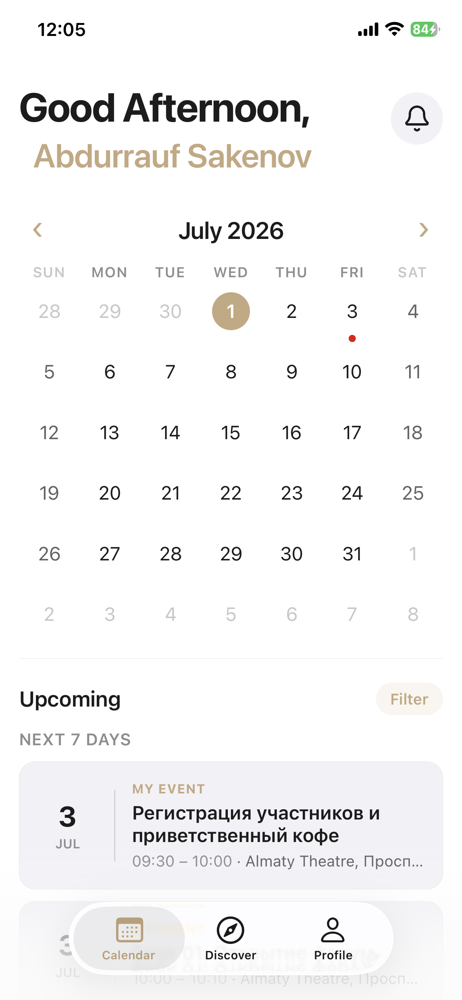

  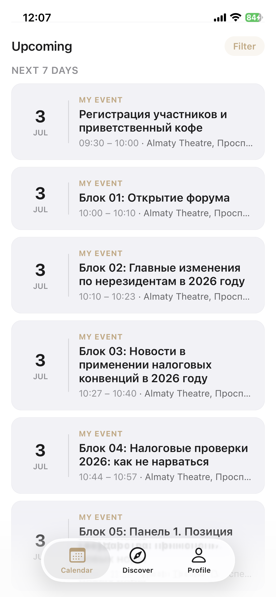

#### 2. Обнаружение (Discover) и Сообщества

  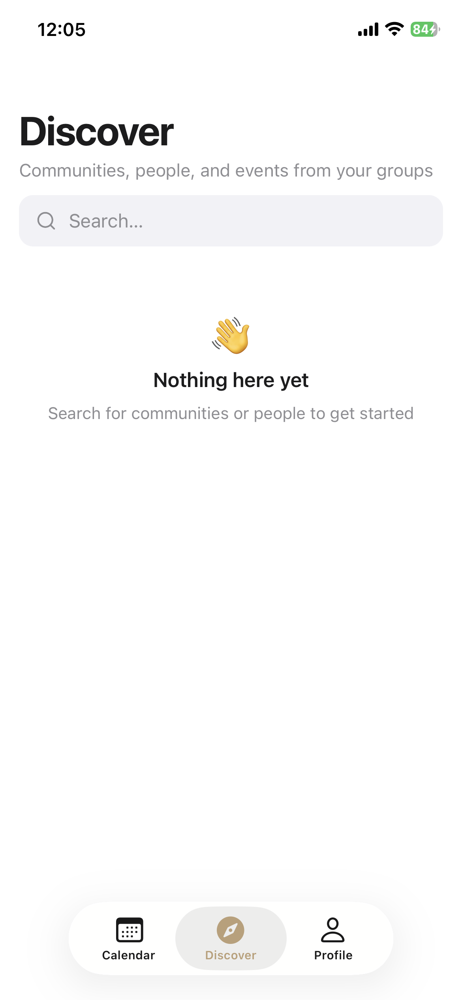

  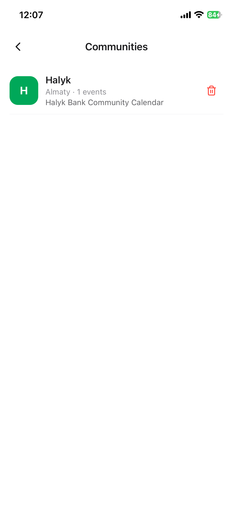

  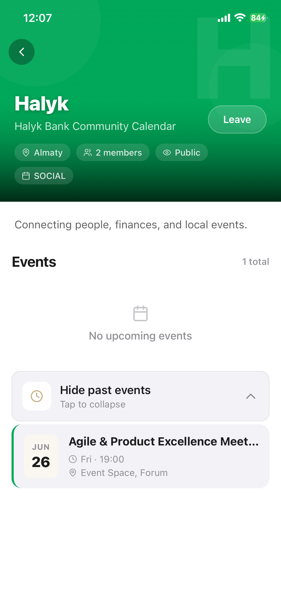

#### 3. Друзья и Соединения (Connections)

  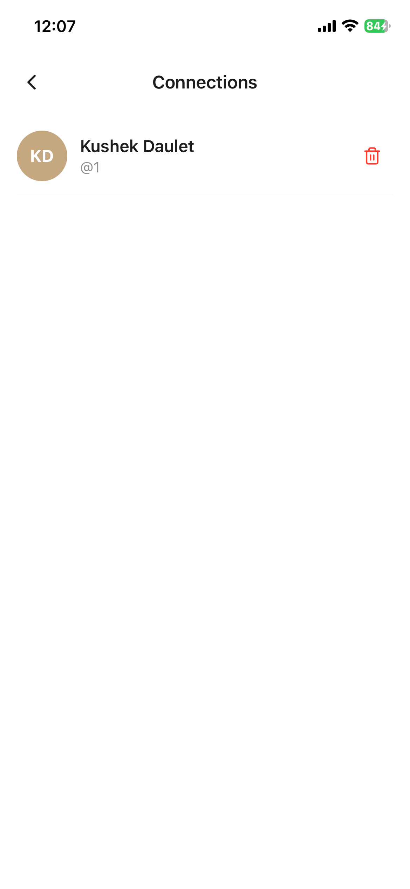

#### 4. Настройки профиля

  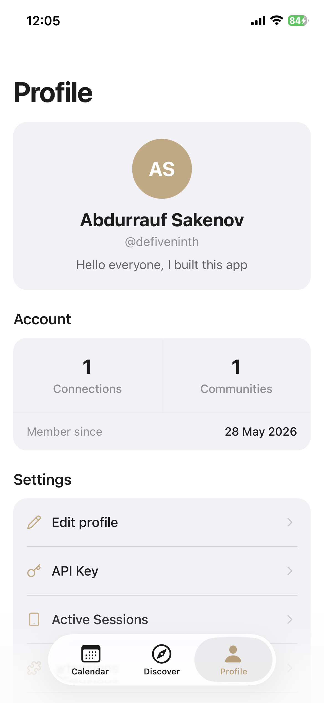

  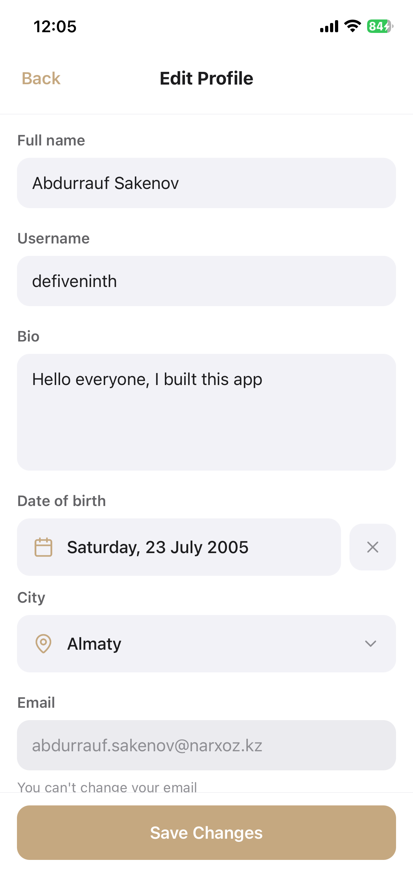

#### 5. Безопасность и Расширения (Extensions)

  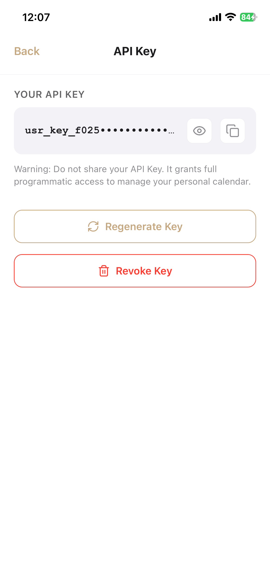

  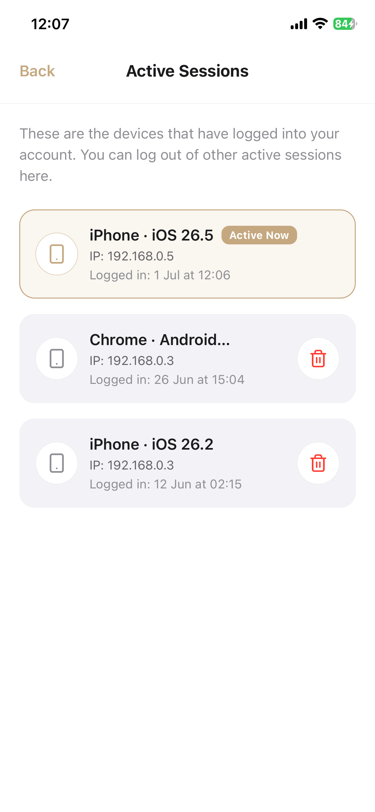

  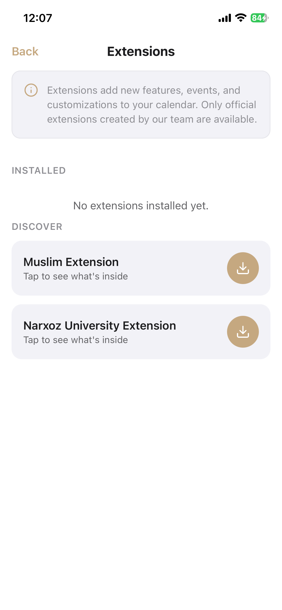

#### 6. Локализация, Системные настройки и Темы

  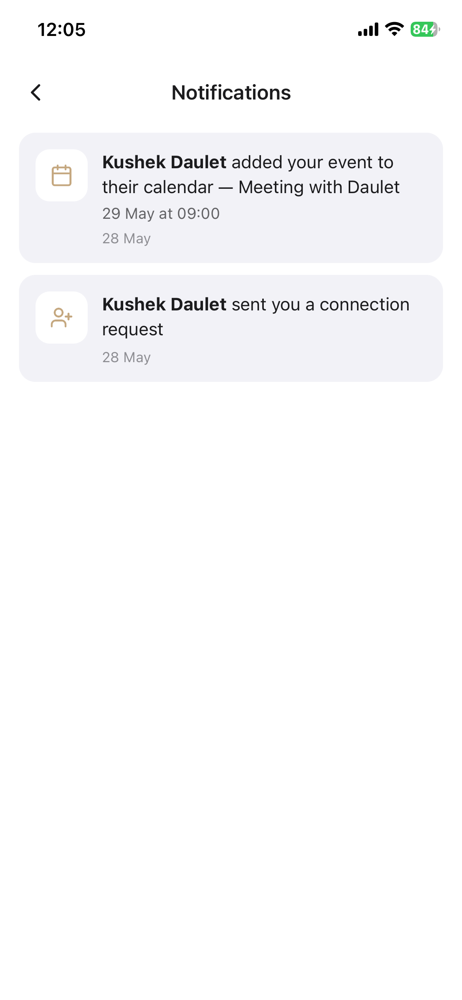

  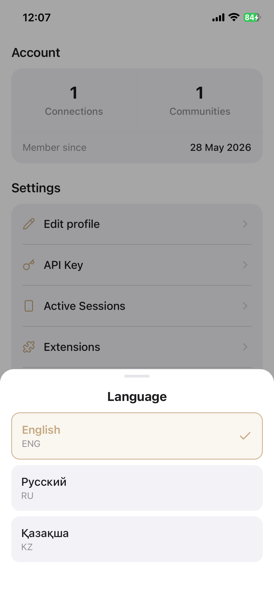

#### 7. Темная тема (Theme Switcher)

  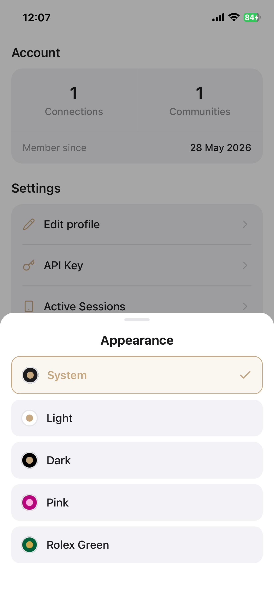

