# Сәкенов Абдуррауф Саматұлы
**Javascript fullstack developer, ios swift developer**

---

## 🗺 Навигация
* [📞 Контакты & Информация](#-контакты--информация)
* [🛠 Технические навыки](#-технические-навыки)
* [💼 Опыт работы](#-опыт-работы)
* [📁 Проекты](#-проекты)
* [🎯 Про меня](#-про-меня)
* [📸 Жизненная активность](#-жизненная-активность)

---

## 📞 Контакты & Информация
* **Возраст:** 21 год (23.07.2005)
* **Локация & Формат:** Алматы
* **Занятость:** Фуллтайм офис, гибрид, частичная, проектная, стажировка
* **Контакты:** [+7 (776) 004 41 05](tel:+77760044105) | [t.me/defiveninth](https://t.me/defiveninth) | [abdurrauf.sakenov@proton.me](mailto:abdurrauf.sakenov@proton.me)
* **Профили:** [GitHub](https://github.com/defiveninth)
* **Языки:** Казахский (родной), Русский (свободный), Английский (B1)
* **Желаемая ЗП:** от 400 000 KZT
* **Желаемая Должность:** Javascript backend, javascript frontend, mobile developer
* **Образование:** Университет Нархоз, 4 курс, специальность «IT, Digital Engineer» (неоконченное высшее).

---

## 🛠 Технические навыки

* **Языки программирования**
  * Глубокий знание: JavaScript (ES6+), TypeScript, Swift
  * HTML5, CSS3
  * Базовый опыт: Python, Java, MQL5

* **Backend-разработка**
  * **Фреймворки:** NestJS, Fastify, Express, FastAPI (Python)
  * **ORM / Database Tools:** Prisma, TypeORM
  * **Базы данных:** PostgreSQL, MySQL, SQLite, JSONDB, Redis (кэширование, сессии)

* **Архитектура & Аутентификация**
  * **Протоколы и подходы:** RESTful APIs, GraphQL, WebSockets (real-time), MVC, Microservices, HTTP/HTTPS
  * **Авторизация:** JWT, NextAuth, Session-based auth, Интеграция сторонних провайдеров (OAuth / 3rd party)

* **Frontend Web**
  * **Фреймворки:** React, Next.js (App / Pages Router)
  * **Стилизация & UI:** Tailwind CSS, shadcn/ui, Ant Design, Figma
  * **Управление состоянием:** React Context API, Redux
  * **Инструменты & Деплой:** React Hook Form, lucide-react, react-icons, i18n (мультиязычность), Vercel

* **Мобильная разработка**
  * **Технологии:** React Native (Expo), SwiftUI (iOS native)
  * **Компоненты & UI:** Верстка экранов любой сложности, темная/светлая темы (Theme Switcher), анимации
  * **Функционал:** Интеграция Native API (геолокация, камера), мультиязычность (i18n), обработка push-уведомлений
  * **Клиент-сервер:** Синхронизация данных через HTTP, GraphQL и WebSockets

* **AI Инструменты & Автоматизация (AI-Driven Development)**
  * **Среды разработки & Ассистенты:** Cursor, Claude Code, GitHub Copilot, Codex, OpenCode, Antigravity
  * **Интеграция моделей (LLM API):** Работа и автоматизация процессов на базе Gemini 3.1/3.5, QWEN, ChatGPT, Claude
  * **Локальный ИИ:** Развертывание и использование моделей через Ollama
  * **Скрипты:** Написание Python/JS скриптов для парсинга данных, автоматического заполнения баз данных и имитации действий пользователей

* **DevOps & Инструменты**
  * **Контроль версий:** Git, GitHub, GitLab
  * **Пакетные менеджеры:** npm, yarn, pnpm
  * **Контейнеризация:** Docker
  * **Окружение:** macOS (MacBook Pro)

---

## 💼 Опыт работы

#### **TeqserTeam** | *Мобильный разработчик* — `12.2025 — 05.2026`
*Кибербезопасность, инкубатор NURIS.*
* Разработал с нуля мобильное приложение и опубликовал его в Google Play Store.
* Спроектировал и реализовал Backend API, интегрировал оплату Kaspi в веб-версию.
* Оптимизировал бэкенд на Python (FastAPI): перевел авторизацию с номеров на email без потери клиентской базы.
* Реализовал трекинг действий пользователей в БД с последующим AI-анализом.

#### **Ybirai Education** | *Frontend-разработчик* — `12.2023 — 06.2024`
*EdTech-стартап.*
* Реализовал интерфейсы платформы и улучшил пользовательский опыт (UX).
* Получил глубокий опыт работы со сложными медиафайлами (фото, видео, текст).
* Повысил общую безопасность клиентской части приложения.

#### **Электронная очередь Университета Нархоз** | *Frontend-разработчик* — `02.2023 — 10.2023`
*Цифровизация физических очередей вуза.*
* Настроил интеграцию серверного API на стороне клиента.
* Внедрил WebSockets для обновления интерфейсов в реальном времени без перезагрузки страниц.
* Оптимизировал фронтенд для стабильной работы приложения в периоды пиковых нагрузок.

---

## 📁 Проекты

### Web Apps
* **[Электронная очередь Нархоз Web App](./projects/e-queue/readme.md)** — `Screenshots` `Production Link` `Next.js` 
* **[Tekser Landing Web App](./projects/tekser-landing/readme.md)** — `Screenshots` `Production Link` `Next.js` 
* **[Mizucare Web App](./projects/mizu-care/readme.md)** — `Screenshots` `Source Code` `Production Link` `Web Fullstack Next.js` `Gemini AI`
* **[Smart Parking Web App](./projects/smart-parking/readme.md)** — `Screenshots` `Source Code` `Next.js` 
* **[SenseLab Web App](./projects/senselab/readme.md)** — `Screenshots` `Source Code` `NextJs` `Gemini AI`
* **[Nextgen blogpost Web App](./projects/nextgen-blogpost/readme.md)** — `Screenshots` `Source Code` `NextJs` `PSQL`
* **[TakeQuiz Web App](https://github.com/defiveninth/quiz-app-front/blob/master/README.md)** — `Screenshots` `Source Code` `NextJS`

### Mobile Apps
* **[Tekser Mobile App](./projects/tekser/readme.md)** — `Screenshots` `React Native` `Gemini AI`
* **[Wagwan Mobile App](./projects/wagwan/readme.md)** — `Screenshots` `React Native` 
* **[Book Table Mobile App](./projects/book-table/readme.md)** — `Screenshots` `Source Code` `Swift`

### Server Apps
* **[Book Table Server App](https://github.com/defiveninth/rrs-mobile/blob/main/rrs-server/README.md)** — `Source Code` `Documentation` `ExpressJS` `SQLite`
* **[Smart Parking Server App](https://github.com/dilfuza00/parking-app/blob/main/server/README.md)** — `Source Code` `Documentation` `ExpressJS` `SQLite`
* **[TakeQuiz Server App](https://github.com/defiveninth/quiz-app-back/blob/new-branch/README.md)** — `Source Code` `Documentation` `Nestjs` `SMTP` `Prisma` `PSQL` 

### Terminal Apps
* **[Smart Parking AI CV](./projects/parking-count/readme.md)** — `Screenshots` `Source Code` `YOLO openCV Python` 

> **Расшифровка тегов:**
> * `Web` / `Mobile` / `Server` — тип платформы или архитектурного слоя.
> * `Next.js` / `React Native` / `Swift` / `NestJS` / `Express` — основной технологический стек.
> * `Screenshots` — в документации проекта присутствуют скриншоты интерфейса.
> * `Production Link` — проект развернут и доступен по живой ссылке (активный продакшн).
> * `Source Code` — открытый исходный код (ссылка на публичный репозиторий).
> * `Gemini AI` — интеграция искусственного интеллекта на базе моделей Gemini.

---

## 🎯 Про меня

* **Креативность и продуктовое видение:** Всегда анализирую текущее состояние проекта и предлагаю идеи для его дальнейшего развития.
* **Критическое мышление:** Нацелен на конечный результат; просчитываю долгосрочные последствия принимаемых решений и возможные риски.
* **Problem Solving (Решение проблем):** Эффективно решаю сложные задачи через глубокое понимание сути проблемы, обсуждение и фокус на нужном результате.
* **Командная работа и коммуникация:** Профессионально веду деловые обсуждения, эффективно взаимодействую внутри команды и нацелен на общий успех.
* **Высокая отзывчивость (Responsiveness):** Всегда на связи, оперативно реагирую на рабочие запросы и не игнорирую сообщения в чатах.
* **Стрессоустойчивость:** Уверенно работаю в условиях высокой многозадачности и плотного потока задач.
* **Организованность и продуктивность:** Умею эффективно выстраивать свой рабочий процесс для достижения максимальной производительности.
* **Дисциплина и баланс:** Регулярно занимаюсь спортом, что помогает поддерживать высокий уровень энергии, концентрации и стрессоустойчивости.

---

## 📸 Жизненная активность

В этом разделе представлены фотографии с различных профессиональных мероприятий, хакатонов, встреч и этапов развития стартап-проектов.

### 🎤 Выступления и Хакатоны
* **Хакатон МУИТ (Выступление в качестве спикера):**
  Делился практическим опытом разработки, командного взаимодействия и запуска проектов с участниками хакатона.
  
  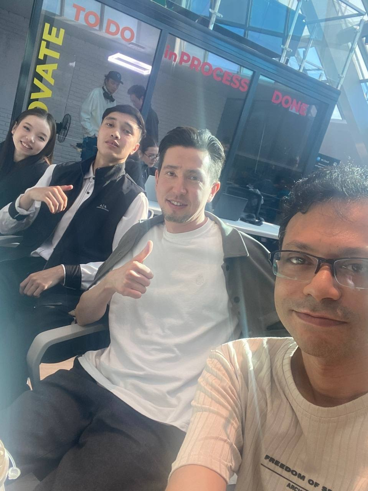
  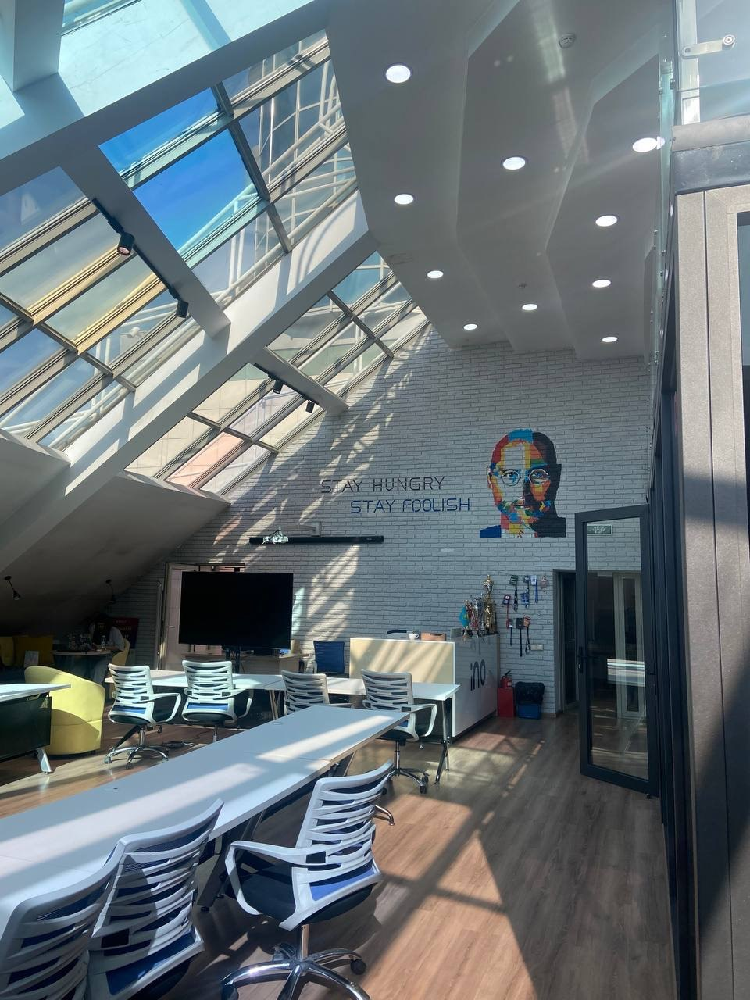

* **Halyk Hackathon 2025 & Финтех-ивенты:**
  Участие в хакатоне Halyk Bank 2025, разработка и презентация финтех-решений, а также нетворкинг на крупных финансовых мероприятиях.
  
  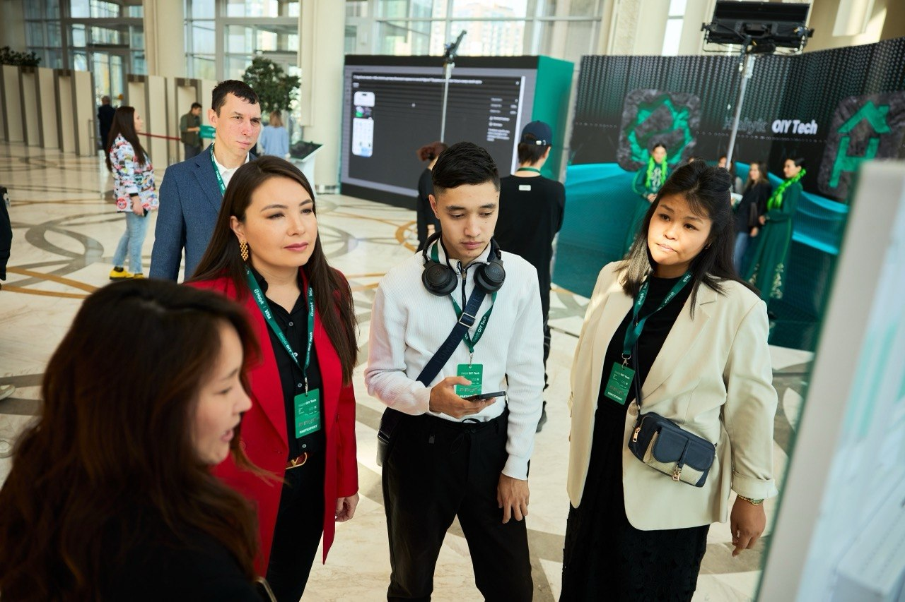
  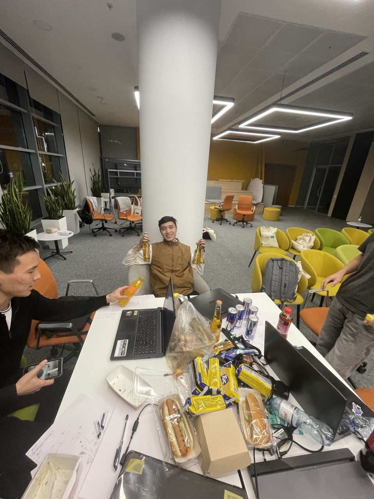
  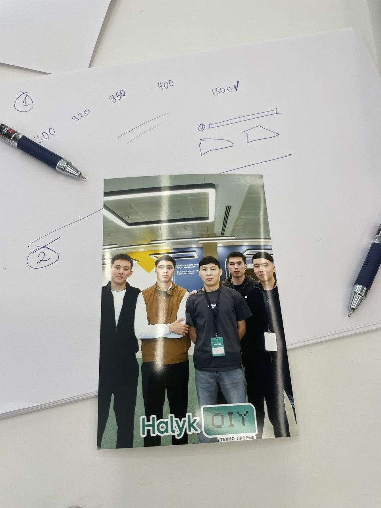

### 🌐 Sammit-ы и Нетворкинг
* **Solana Summit:**
  Погружение в экосистему Web3, обсуждение трендов блокчейн-технологий, смарт-контрактов и децентрализованных приложений.
  
  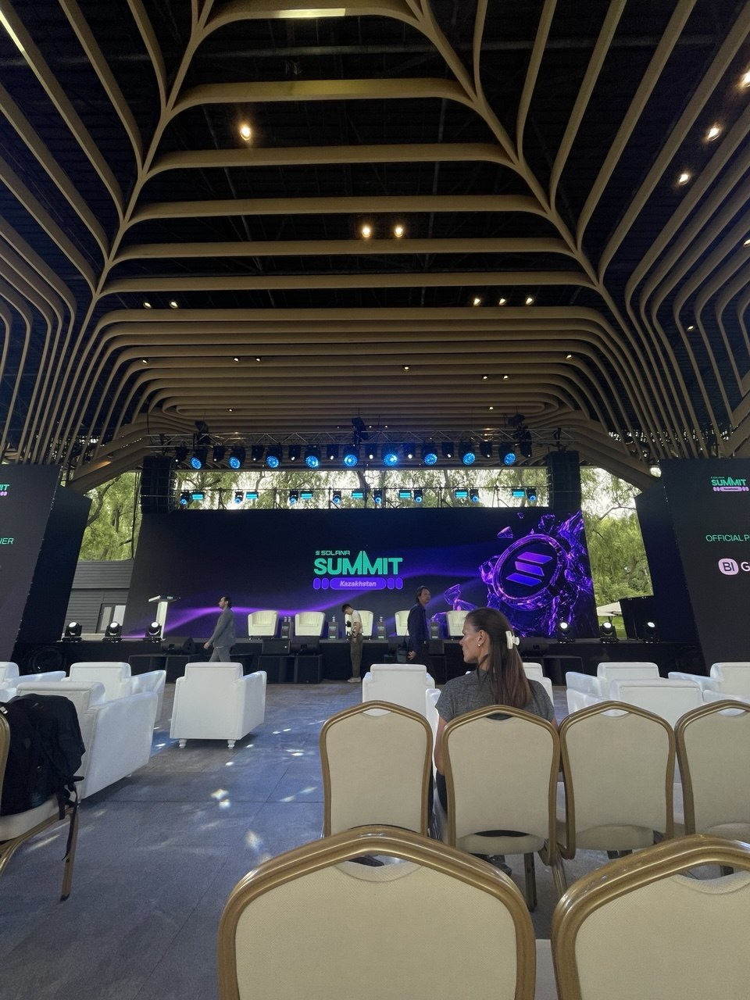

* **Нетворкинг в SDU (Университет имени Сулеймана Демиреля):**
  Обсуждение совместных IT-проектов и академический нетворкинг с активными студентами и разработчиками.
  
  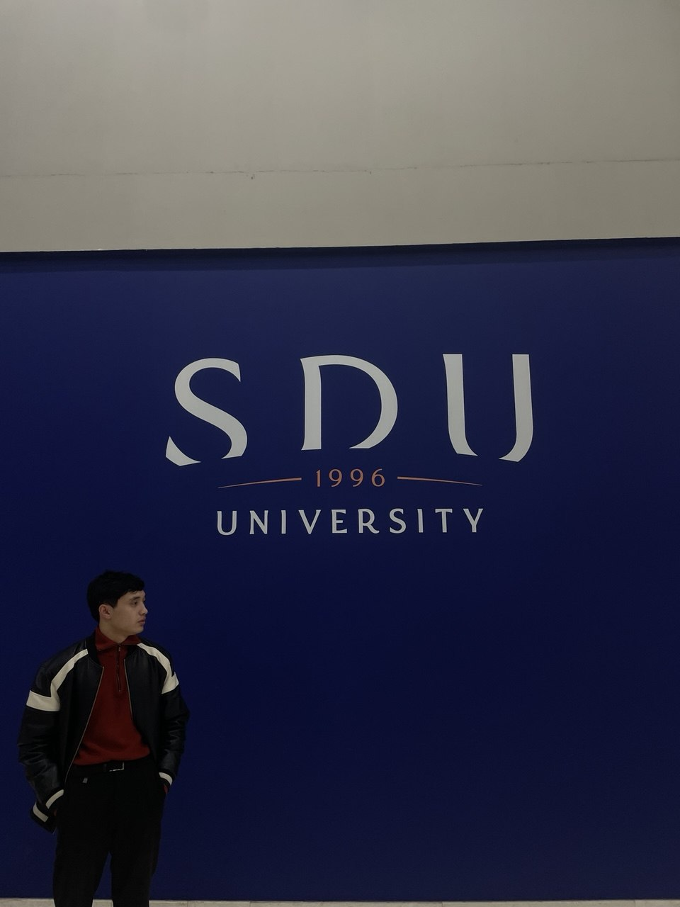

* **Montfort Career & Vacancy Day:**
  Посещение ярмарки вакансий, общение с представителями технологических компаний и обсуждение карьерных возможностей.
  
  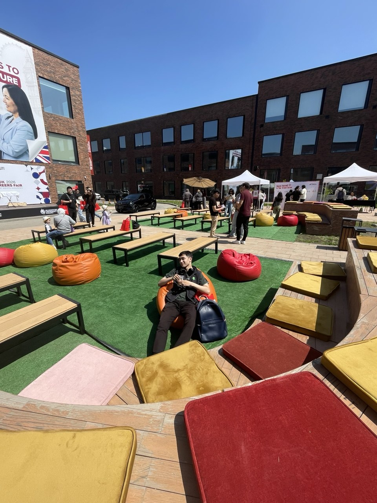

### 📈 Стартап-деятельность и интересы
* **Инкубация стартапа Tekser:**
  Презентация и защита проекта на втором этапе программы инкубации (ABC Incubation).
  
  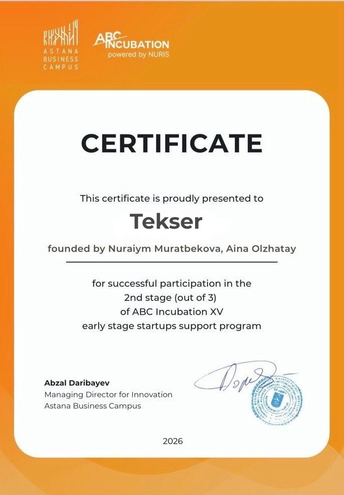

* **Интерес к блокчейну и финансам:**
  Посещение специализированных митапов, глубокое изучение финтех-индустрии и технологий распределенного реестра.
  
  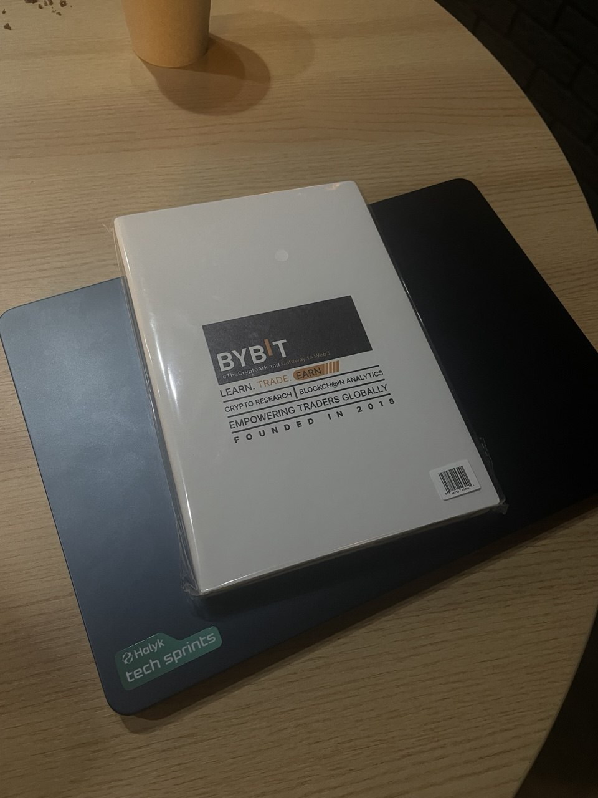
  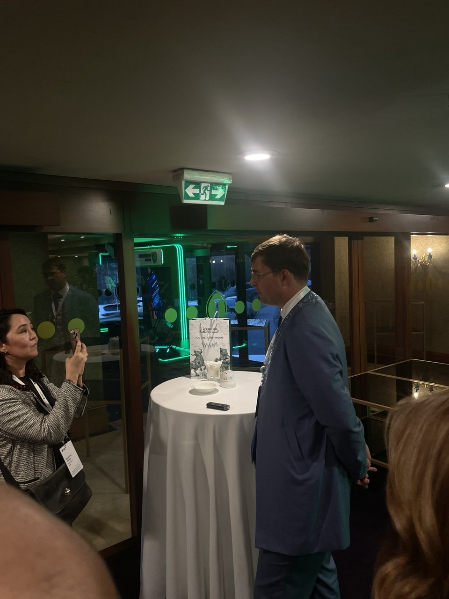
